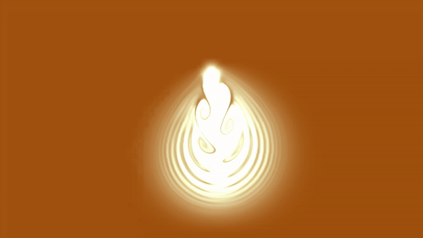

# Latte Art simulation

## TODO

- Publish to gh pages (as is in `./site` folder)
- Uncaught DOMException: Failed to execute 'texImage2D' on 'WebGL2RenderingContext': The image element contains cross-origin data, and may not be loaded.
  - at Image.image.onload (file:///Users/daniel/Code/iMetrical/latte-art/site/script.js:1066:8)
- Convert to nx and next.js
  - publish to vercel (latte-art.v.daneroo.com)
## Forked from Upstream WebGL Fluid Simulation

[Original Demo](https://paveldogreat.github.io/WebGL-Fluid-Simulation/)

## References

- Forked from <https://github.com/PavelDoGreat/WebGL-Fluid-Simulation>
- <http://developer.download.nvidia.com/books/HTML/gpugems/gpugems_ch38.html>
- <https://github.com/PavelDoGreat/WebGL-Fluid-Simulation>
- <https://github.com/haxiomic/GPU-Fluid-Experiments>

## License

The code is available under the [MIT license](LICENSE)
